# 💰 API Financeira com Monitoramento

[](https://fastapi.tiangolo.com/)
[](https://www.python.org/downloads/)
[](https://www.mysql.com/)
[](https://www.docker.com/)

Uma API REST moderna para gerenciamento de operações financeiras com sistema completo de monitoramento e observabilidade.

## 📋 Sumário

- [✨ Características](#-características)
- [🚀 Tecnologias](#-tecnologias)
- [📊 Arquitetura de Monitoramento](#-arquitetura-de-monitoramento)
- [⚡ Início Rápido](#-início-rápido)
- [🐳 Executando com Docker](#-executando-com-docker)
- [🌐 Endpoints da API](#-endpoints-da-api)
- [📈 Monitoramento e Métricas](#-monitoramento-e-métricas)
- [📁 Estrutura do Projeto](#-estrutura-do-projeto)
- [💻 Exemplos de Uso](#-exemplos-de-uso)
- [🔧 Desenvolvimento](#-desenvolvimento)
- [📝 Licença](#-licença)

## ✨ Características

- ✅ **API REST completa** com FastAPI
- ✅ **Operações CRUD** para contas e transações
- ✅ **Validação de dados** com Pydantic
- ✅ **Banco de dados MySQL** com SQLAlchemy ORM
- ✅ **Documentação automática** (Swagger/OpenAPI)
- ✅ **Containerização** com Docker
- ✅ **Monitoramento completo** com Prometheus + Grafana
- ✅ **Métricas de sistema** (CPU, memória)
- ✅ **Métricas de aplicação** (requests, latência)
- ✅ **Métricas de banco** (conexões, queries)
- ✅ **Health checks** e observabilidade

## 🚀 Tecnologias

### Backend
- **FastAPI** - Framework web moderno e de alta performance
- **SQLAlchemy** - ORM avançado para Python
- **MySQL 8.0** - Banco de dados relacional
- **Pydantic** - Validação e serialização de dados
- **Uvicorn** - Servidor ASGI de alto desempenho

### Monitoramento & Observabilidade
- **Prometheus** - Sistema de monitoramento e alertas
- **Grafana** - Visualização de métricas e dashboards
- **cAdvisor** - Monitor de containers
- **MySQL Exporter** - Exportador de métricas do MySQL

### DevOps
- **Docker & Docker Compose** - Containerização e orquestração
- **Git** - Controle de versão

## 📊 Arquitetura de Monitoramento

```mermaid
graph TB
    A[FastAPI App] --> B[Prometheus]
    C[MySQL] --> D[MySQL Exporter] --> B
    E[cAdvisor] --> B
    B --> F[Grafana]
    
    A --> G[Métricas HTTP]
    A --> H[Métricas CPU/RAM]
    C --> I[Métricas DB]
    E --> J[Métricas Container]
```



### Portas dos Serviços
| Serviço | Porta | URL |
|---------|-------|-----|
| **API Financeira** | 8888 | http://localhost:8888 |
| **Grafana** | 3000 | http://localhost:3000 |
| **Prometheus** | 9090 | http://localhost:9090 |
| **cAdvisor** | 8080 | http://localhost:8080 |
| **MySQL** | 3306 | localhost:3306 |
| **MySQL Exporter** | 9104 | http://localhost:9104 |

## ⚡ Início Rápido

### Pré-requisitos
- [Docker](https://docs.docker.com/get-docker/) e [Docker Compose](https://docs.docker.com/compose/install/)
- [Git](https://git-scm.com/)

### Clonagem e Execução

```bash
# Clonar o repositório
git clone https://github.com/elizaaugusta4/Api-financeira-microservico.git
cd Api-financeira-microservico

# Executar todos os serviços
docker-compose up --build -d

# Verificar status dos containers
docker-compose ps
```

### 🎯 Acesso Rápido

Após inicialização completa (~2 minutos):

- **📚 API Docs:** http://localhost:8888/docs
- **📊 Grafana:** http://localhost:3000 (admin/admin123)
- **🔍 Prometheus:** http://localhost:9090
- **🐳 cAdvisor:** http://localhost:8080

```

## 🌐 Endpoints da API

### 🏦 Contas

| Método | Endpoint | Descrição | Status |
|--------|----------|-----------|---------|
| `POST` | `/accounts` | Criar nova conta | 201 |
| `GET` | `/accounts` | Listar todas as contas | 200 |
| `GET` | `/accounts/{id}` | Buscar conta por ID | 200 |

### 💸 Transações

| Método | Endpoint | Descrição | Status |
|--------|----------|-----------|---------|
| `POST` | `/transactions` | Criar transação | 201 |
| `GET` | `/transactions` | Listar transações | 200 |
| `GET` | `/transactions/{id}` | Buscar transação | 200 |
| `PUT` | `/transactions/{id}` | Atualizar transação | 200 |
| `DELETE` | `/transactions/{id}` | Remover transação | 204 |

### 💰 Saldo

| Método | Endpoint | Descrição |
|--------|----------|-----------|
| `GET` | `/accounts/{id}/balance` | Consultar saldo da conta |

### 🔧 Sistema

| Método | Endpoint | Descrição |
|--------|----------|-----------|
| `GET` | `/` | Informações da API |
| `GET` | `/health` | Health check |
| `GET` | `/metrics` | Métricas Prometheus |
| `GET` | `/db-metrics` | Métricas do banco (debug) |

## 📁 Estrutura do Projeto

```
Api-financeira-microservico/
├── 📁 app/                          # Código da aplicação
│   ├── __init__.py
│   ├── app.py                       # App principal FastAPI
│   ├── database.py                  # Configuração BD
│   ├── models.py                    # Modelos SQLAlchemy
│   └── schemas.py                   # Schemas Pydantic
├── 📁 monitoring/                   # Configurações de monitoramento
│   ├── prometheus.yml               # Config Prometheus
│   └── 📁 grafana/
│       └── 📁 provisioning/
│           └── 📁 datasources/
│               └── prometheus.yml   # DataSource Grafana
├── docker-compose.yml               # Orquestração completa
├── Dockerfile                       # Imagem da API
├── requirements.txt                 # Deps Python
├── .my.cnf                         # Config MySQL Exporter
└── README.md                       # Esta documentação
```

## 📝 Licença

Este projeto está licenciado sob a [MIT License](LICENSE).

---

<div align="center">

**⭐ Se este projeto foi útil, considere dar uma estrela!**

Desenvolvido com ❤️ por [Eliza Augusta](https://github.com/elizaaugusta4)

</div>